# Stellar-Stratum: User Flow Documentation

> **Complete documentation of all user flows with diagrams**

---

## 🏠 **Landing Page**

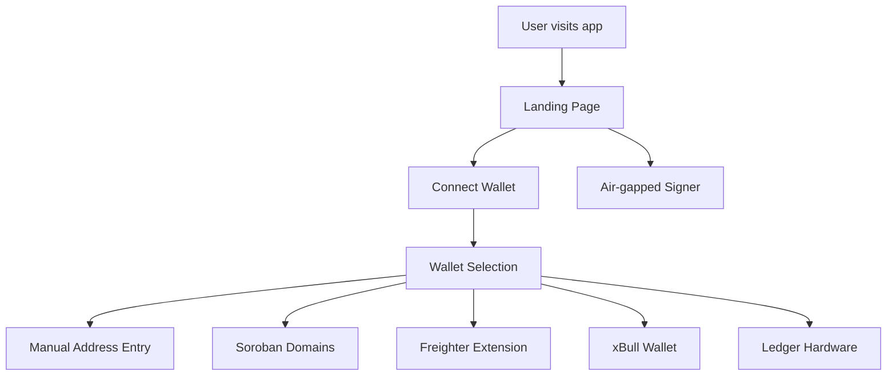

---

## 🔗 **Wallet Connection Flow**

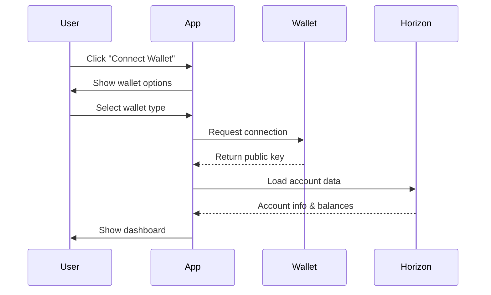

---

## 💰 **Dashboard Overview**

```mermaid
flowchart TD
  Dashboard[Account Dashboard] --> Balances[Balances Section - Expandable]
  Dashboard --> Activity[Activity Section - Expandable]
  Dashboard --> Multisig[Multisig Section - Expandable]
  Dashboard --> Transaction[Initiate Transaction Button]
  
  Balances --> Assets[Asset List with Real-time Prices]
  Balances --> Prices[40+ Fiat Currency Support]
  Balances --> Total[Portfolio Value Calculation]
  Balances --> Refresh[Auto-refresh Every 30s]
  
  Activity --> History[Transaction History with Filters]
  Activity --> Chart[Balance Trend Chart - Fixed Date Issues]
  Activity --> Filters[Direction, Category, Asset Filters]
  Activity --> Export[Export Transaction Data]
  
  Multisig --> Config[Multisig Configuration Builder]
  Multisig --> Signers[Signer Management & Weights]
  Multisig --> Thresholds[Threshold Settings (Low/Med/High)]
  Multisig --> Validation[Real-time Validation & Warnings]
```

---

## 🔄 **Transaction Building Flow**

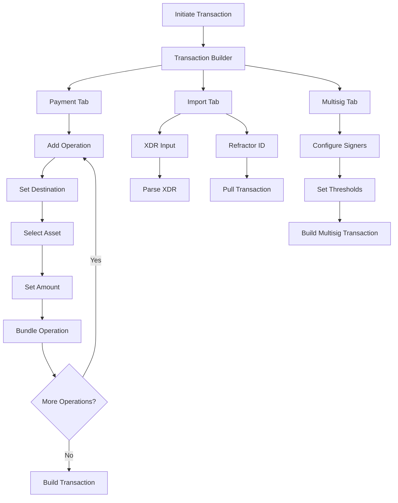

---

## 🔐 **Transaction Signing Flow**

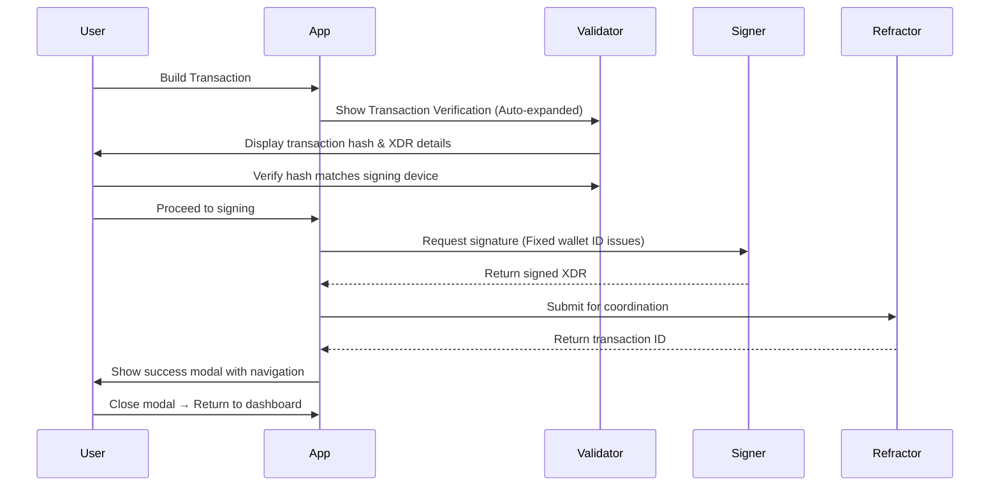

---

## 📱 **Multisig Coordination Flow**

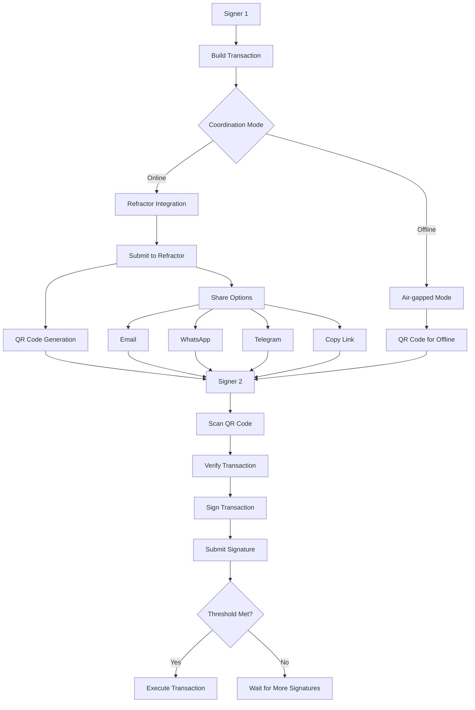

---

## 🔒 **Account Merging Flow**

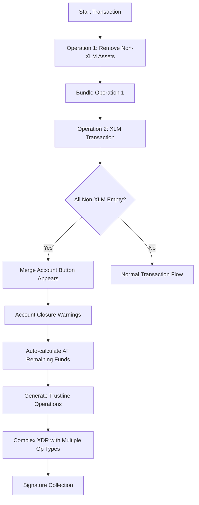

---

## 🌐 **Network & Currency Flow**

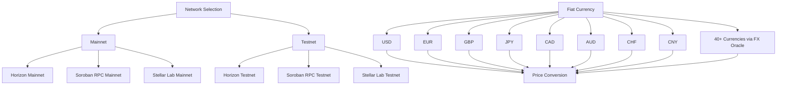

---

## 🔍 **Address Book Flow**

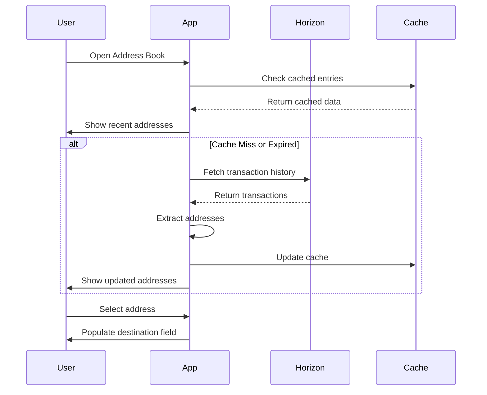

---

## 📊 **Price & Oracle Flow**

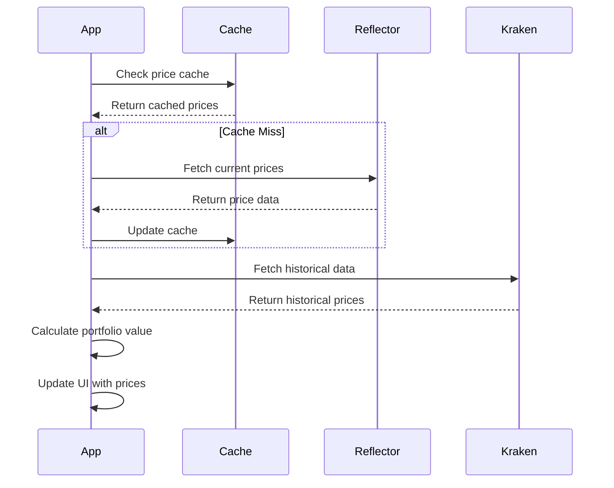

---

## 🛡️ **Security Verification Flow**

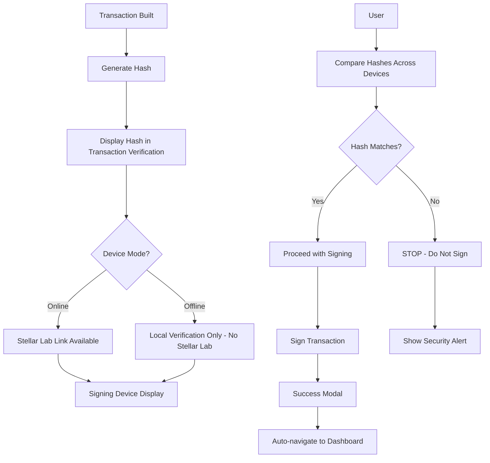

---

## 📱 **Mobile & Responsive Flow**

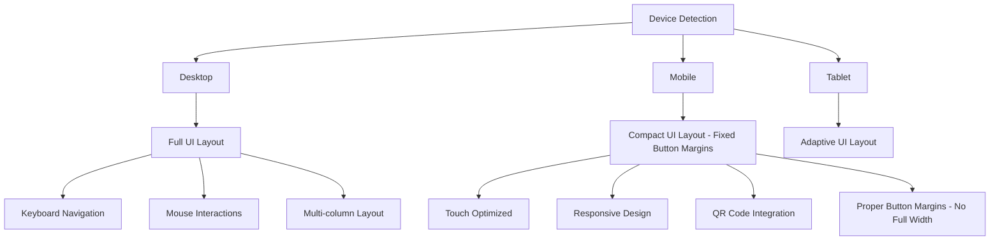

---

## 📈 **Chart & Data Visualization Flow**

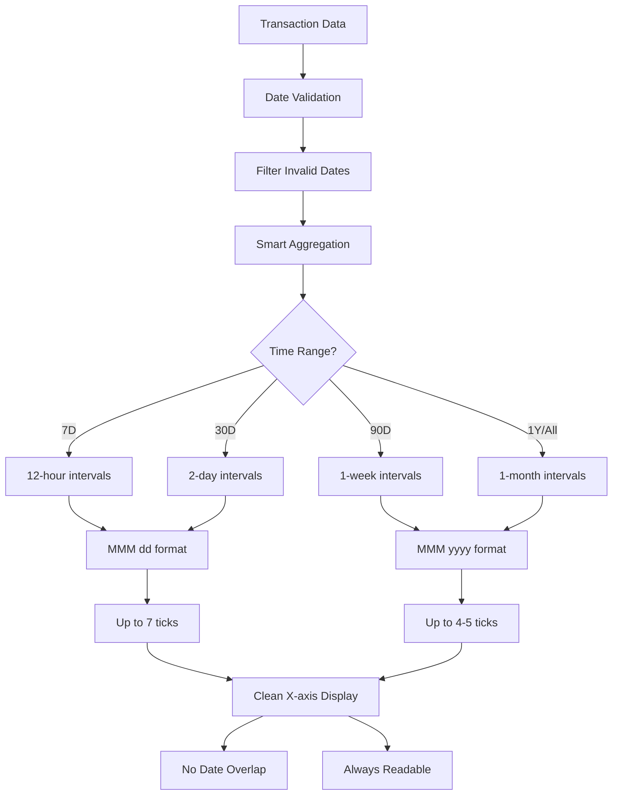

---

## 🔄 **Error Handling Flow**

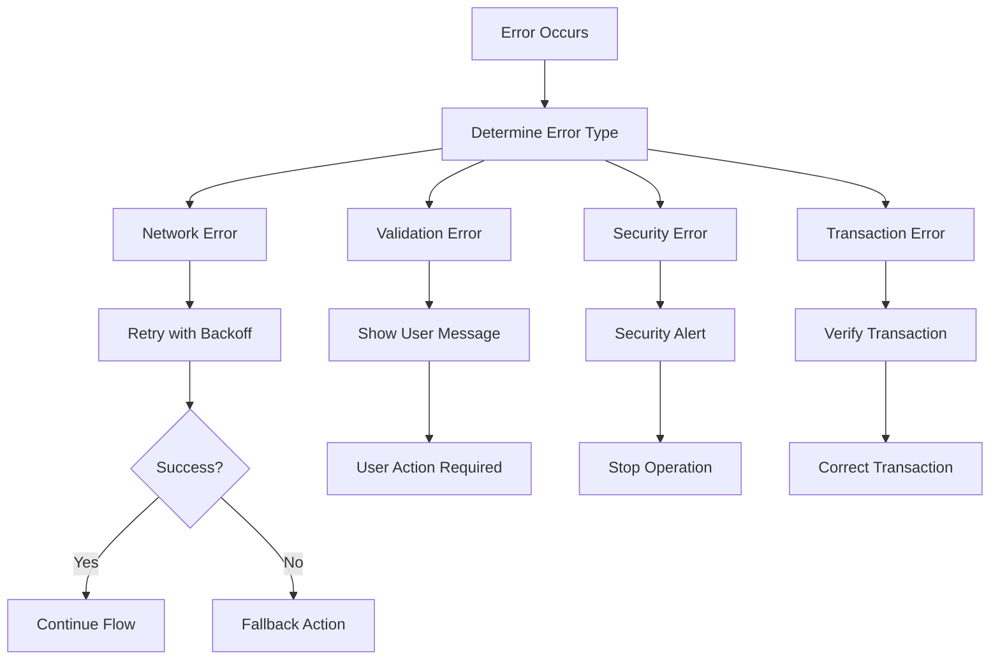

---

## 🎯 **Key User Journeys**

### **Journey 1: First-time User**
1. Visit app → Connect wallet → View dashboard with expandable sections → Learn features

### **Journey 2: Regular Transaction**
1. Dashboard → Initiate transaction → Build payment → Verify with Stellar Lab → Sign → Success modal → Auto-return to dashboard

### **Journey 3: Multisig Coordination**
1. Build transaction → Share QR/Email/WhatsApp/Telegram → Collect signatures → Execute → Success modal

### **Journey 4: Account Management**
1. View balances → Check activity with readable chart → Configure multisig → Manage signers

### **Journey 5: Account Closure**
1. Build transaction → Remove all assets → Merge account → Final XLM transfer

### **Journey 6: Air-gapped Signing**
1. Scan QR code → Verify transaction locally (no Stellar Lab) → Sign → Generate signature QR

### **Journey 7: Chart Analysis**
1. View activity → Select time range → See clean, readable chart with proper date formatting → Analyze trends

---

