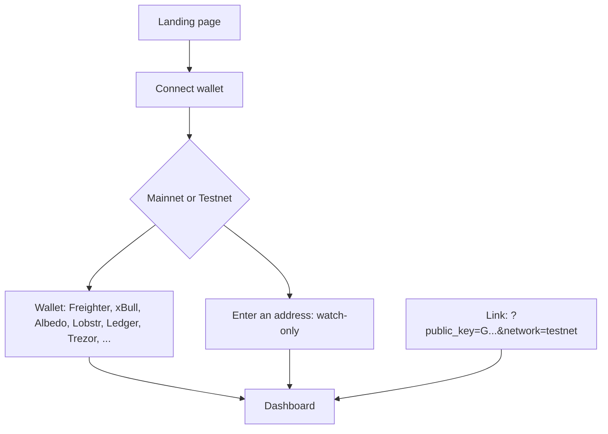
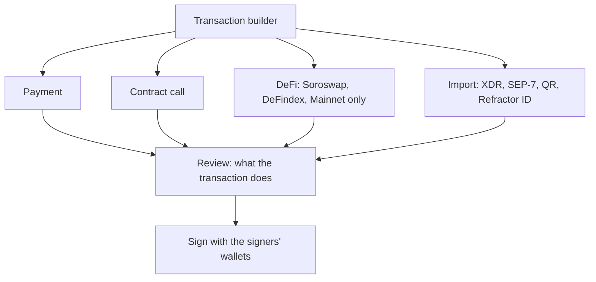

# Stellar Stratum: user flows

How the app is used, screen by screen. Everything works on Mainnet and Testnet; the network is
chosen when connecting and carried by share links and QR codes.

## Connect

```mermaid
flowchart TD
  Landing[Landing page] --> Connect[Connect wallet]
  Connect --> Network{Mainnet or Testnet}
  Network --> Wallet[Wallet: Freighter, xBull, Albedo, Lobstr, Ledger, Trezor, ...]
  Network --> Manual[Enter an address: watch-only]
  Wallet --> Dashboard
  Manual --> Dashboard
  Link["Link: ?public_key=G...&network=testnet"] --> Dashboard
```

A watch-only account can build transactions and collect signatures from other devices; it just
cannot sign itself. The URL keeps the account, network and current view, so any screen can be
reloaded or shared.

## Dashboard

- **Balances**: every asset with its issuer, valued with Reflector prices on Mainnet (assets are
  matched by code and issuer, so a look-alike "USDC" is not priced as the real one). Testnet
  balances have no market value.
- **Activity**: payments, swaps, contract transfers and configuration changes, with filters and a
  balance chart. New transactions are picked up on refresh.
- **Multisig**: signers, weights and thresholds, and **Edit configuration**.

## Build a transaction

```mermaid
flowchart TD
  Builder[Transaction builder] --> Payment[Payment]
  Builder --> Contract[Contract call]
  Builder --> DeFi[DeFi: Soroswap, DeFindex, Mainnet only]
  Builder --> Import[Import: XDR, SEP-7, QR, Refractor ID]
  Payment --> Review
  Contract --> Review
  DeFi --> Review
  Import --> Review[Review: what the transaction does]
  Review --> Sign[Sign with the signers' wallets]
```

- **Payment**: one or more operations in one transaction, with a single transaction memo (text or
  ID). Unfunded destinations are created, cross-asset payments use Horizon's best path within the
  chosen slippage, and "Merge account" closes the account after emptying its trustlines. Everything
  is checked against the live account when building: trustlines, the minimum reserve, memos
  required by exchanges.
- **Contract call**: any Soroban contract, including Stellar Asset Contracts. A call that fails in
  simulation, or that needs another address to authorize it, is refused.
- **DeFi**: the transaction returned by the Soroswap or DeFindex API is checked against the request
  (account, contract, amounts, recipient, authorizations) before it can be signed.
- **Transactions are valid for 24 hours**, so co-signers have time to sign.

## Review and sign

The review screen shows, before any signature:

- each operation in plain words, with its counterparty, amounts, prices, asset issuers and the
  account it acts on when that is not the source; look-alike assets (a "USDC" that is not Circle's,
  a token called "XLM") are flagged;
- what a configuration change does to signers and thresholds, with lockout warnings, including
  signers that are not keys (pre-authorised transactions, hash(x));
- for contract calls, everything the signature authorises, including nested token transfers;
- the fee in XLM, when the transaction can land (time and ledger bounds, minimum sequence number,
  extra signers) and whether its sequence number fits the account;
- memos with invisible or direction-changing characters made visible;
- the transaction hash for the selected network, to compare with the signing device.

The current network is always shown at the top. When a link switches it, the app says so until
you acknowledge it.

Signatures are counted only when they verify against the transaction, for every account involved
and at the threshold its operations need (for example, high for signer changes and merges).

## Coordinate signatures

```mermaid
flowchart TD
  Signed[Partly signed] --> Mode{How?}
  Mode -->|Online| Refractor[Refractor: share link or QR]
  Mode -->|Offline| Airgap[Air-gap QR]
  Refractor --> CoSigner[Co-signer opens the link on the right network]
  Airgap --> Device[/sign on the offline device]
  CoSigner --> Enough{Weight reached?}
  Device --> Back[Signature QR back to the online device]
  Back --> Enough
  Enough -->|Yes| Submit[Send to the network]
  Enough -->|No| Mode
```

- **Refractor** stores the transaction for both networks; the share link opens it on its network.
  The transaction pulled must have the hash the link names, so Refractor cannot swap it.
- **Air-gapped signing** (`/sign`): open the page, then take the device offline before loading a
  transaction. The page sends nothing itself and blocks scripts from reaching the network, but the
  protection that counts is the device being offline. It reads the network from the SEP-7 QR,
  shows it, and lets the signer switch it for raw XDR. Large transactions that do not fit one QR
  code can be copied as XDR instead.

## Submit

Submission tries the configured Horizon endpoints in turn and checks whether the transaction
already landed before retrying. A result only a third-party mirror reports is labelled as such.
Failures are explained in plain language (expired, sequence already used, not enough signatures,
memo required, and so on).
